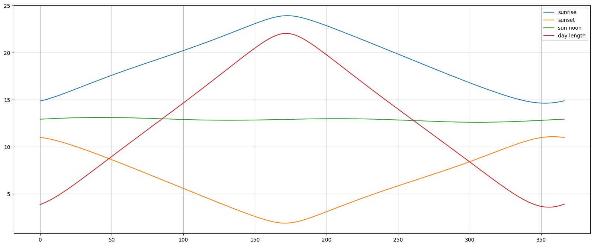
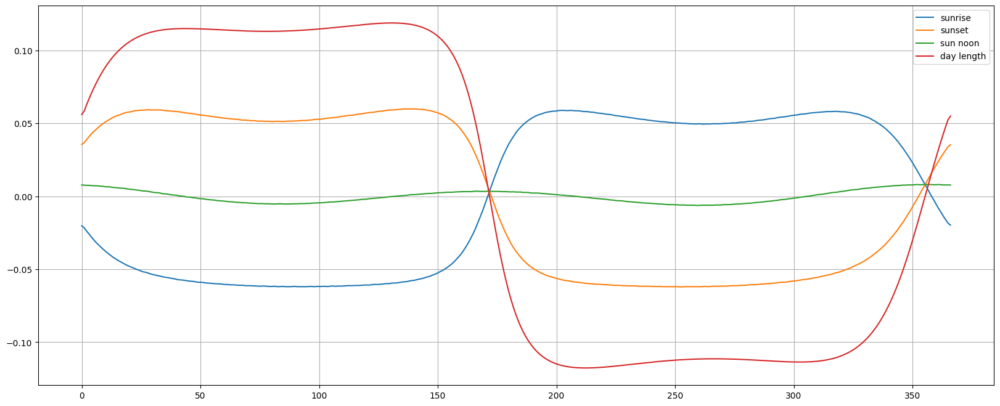
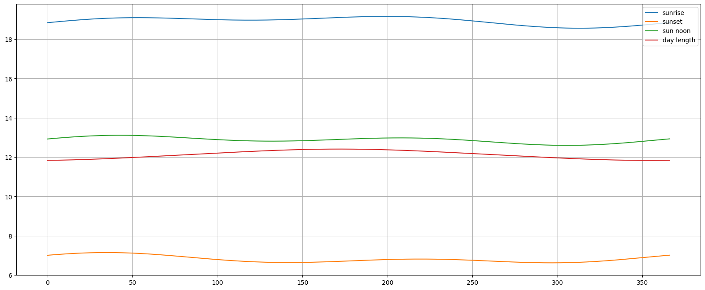
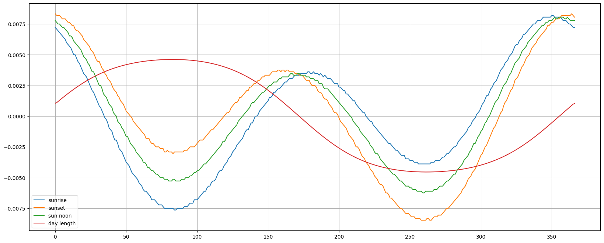
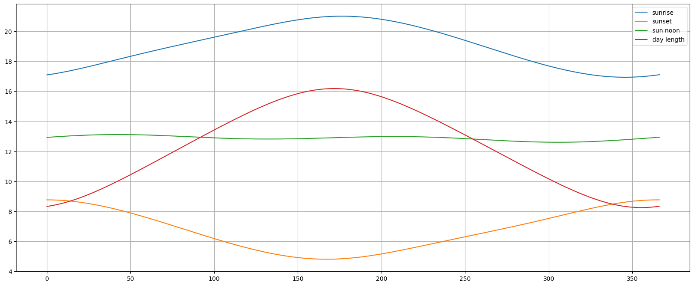
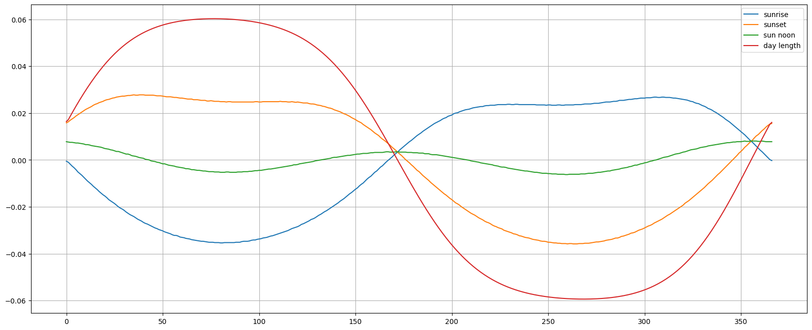

# sunrise-equation
Exploring the [sunrise equation](https://en.wikipedia.org/wiki/Sunrise_equation).

The main question I had was whether it's true that the sunrise and sunset time evolution has a 
slight phase shift, i.e. when the e.g. sunrise starts to happen earlier than the day before, the 
sunset continues to happen earlier than the day before. The answer is yes, this is indeed the 
case.

Here are my findings that help to understand the origin of this effect:
1. The phase shift is evidenced by the shift in the relative positions of the moments when the 
sunrise and sunset times inverse the direction of change.
1. The phase shift is observed around the winter and summer solstice days.
1. The amplitude of the phase shift, as measured from the plots of the derivatives, depends on 
the lattitude of the point. The effect is much stronger near the equator, but zero on the 
equator (see the note below). The effect is almost close to zero near arctic circles for the 
summer solstice, but almost the same for the winter solstice.
1. The amplitude of the phase shift, as measured from the plots of the derivatives, is not equal 
for the winter ands summer solictice and vary significantly.
1. The effect remains weak in the sense that the absolute and relative change in the 
sunset/sunrise time is very weak near the extremum.
1. It seems to be related to the change in the sun noon position. Indeed, it is correlated with 
the maxima of the sun noon change.
1. I have no intuitive explanation for the additional structure of the sunrise/sunset time 
derivatives (a double bump between days 200 and 350 for the sunrise, similar for the sunset at 
the beginning of the year), but this should also be related to the wiggling of the sun noon time.
Indeed, when we approach equator this structure becomes more and more pronounced and finaly the 
three curves - sunrise, sunset and sun noon times - coincide.

More rigourosly, the sunrise and sunset time is calculated as:

$$
T_{sunrise} = T_{sun noon} - \delta_{day length}
$$

$$
T_{sunset} = T_{sun noon} + \delta_{day length}
$$

Their derivatives (differentials):

$$
\Delta T_{sunrise} = \Delta T_{sun noon} - \Delta \delta_{day length}
$$

$$
\Delta T_{sunset} = \Delta T_{sun noon} + \Delta \delta_{day length}
$$

Around the equinox the $\Delta \delta_{day length}$ is large and it determines the change of the 
$T_{sunrise}$ or $T_{sunset}$. However, at the time of solstice the day length is at it's 
extremum value and changes slowly. At the same time the sun noon does its wiggle and the 
$\Delta T_{sun noon}$ prevails. At this moment it can create a phase shift between the sunrise 
and the sunset times due to the +/- signs (e.g. the change must become negative, but because of 
the sun noon wiggle it remains positive). This explains why the phase shift is large near the 
polar circle around the winter solstice since at this moment on this lattitudes the day length 
changes very rapidly (large $\Delta \delta_{day length}$) and the $\Delta T_{sun noon}$ is lower 
than at summer solstice. During summer solstice the day length changes slightly slower but the 
sun noon moves faster and the net effect is stronger. The figure below shows the evolution of the 
different times (sunset, sunrise...) as a function of the day of the year, for the point at 
lattitude 65°00′N just below the arctic circle:

Numerical derivative of the curves on the previous plot:

Near the equator, the day length stays almost the same the whole year, the 
$\Delta \delta_{day length}$ is always small, and the phase shift effect is very strong - notice 
that the derivative of the sun noon time is always of the same order of magnitude as the 
derivatives of the sunrise and sunset times. Here is a plot of the sunrise etc. times for a 
point at lattitude 5°00′N just above th equator:

And corresponding numerical derivatives:

On the mid lattitude the winter and summer solstice have the 
same amount of phase shift:

And corresponding numerical derivatives:

Few helpful links:

[Sunrise equation](https://en.wikipedia.org/wiki/Sunrise_equation) that contains among other the 
Python code used for the simulation.

[Equation of time](https://en.wikipedia.org/wiki/Equation_of_time)

[Equation of Time](https://www.youtube.com/watch?v=Mx9AJJSKIL4) - a YouTube video with a nice and 
clear visualisation of the effects of the Earth's orbit excentiricity and  Earth's axis tilt on 
the time of the solar noon.
